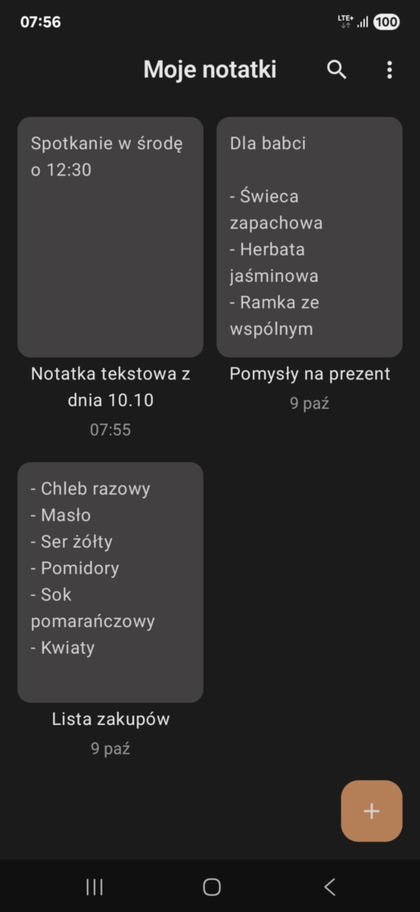
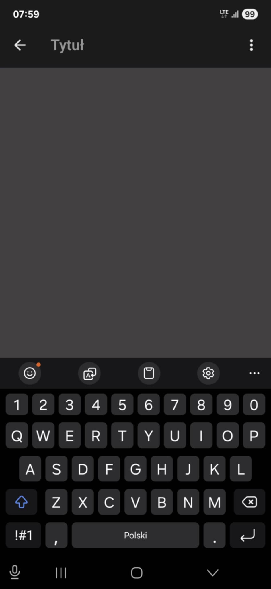
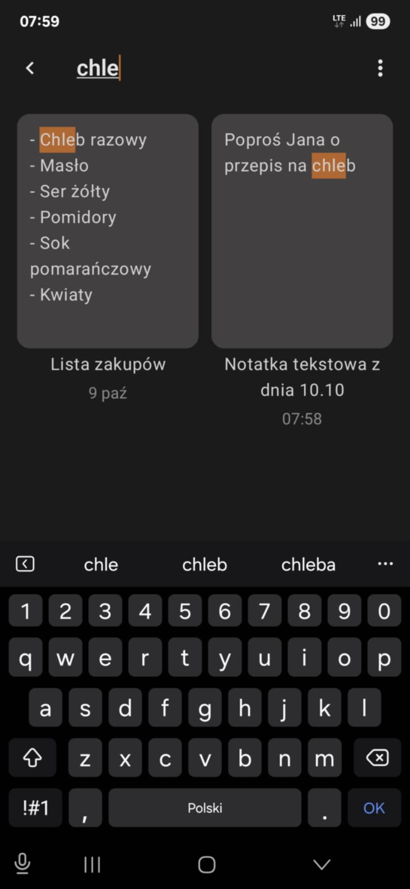
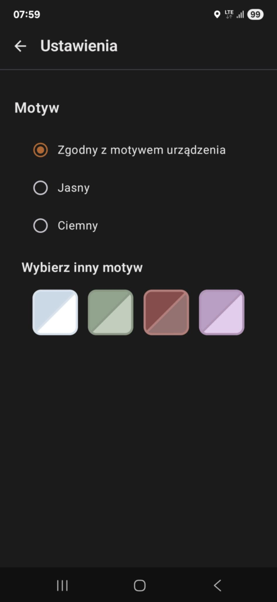

# Notes App

Prosta aplikacja do tworzenia i edycji notatek stworzona w Kotlinie z użyciem Jetpack Compose.  
Projekt powstał jako kolejny etap nauki — skupiony na poznaniu architektury **MVVM**, nawigacji **Navigation 3** oraz lokalnej bazy danych **Room**.

## Funkcje
- Dodawanie nowych notatek  
- Edytowanie istniejących notatek  
- Usuwanie notatek  
- Wyszukiwanie notatek po tytule lub treści  
- Automatyczne zapisywanie zmian  
- Obsługa wielu motywów kolorystycznych

## Screenshots

  
  

  
  

## Technologie
- *Kotlin*
- *Jetpack Compose*
- *Room Database*
- *Navigation 3*
- *MVVM Architecture*

## Struktura projektu
Projekt został oparty o architekturę **MVVM**. W porównaniu do poprzedniego projektu (Shopping List App) kod został rozdzielony na moduły zgodnie z zasadami czystej architektury, co pozwoliło na bardziej skalowalną strukturę.

## Znane problemy
- Przy bardzo długich notatkach bez znaków nowej linii klawiatura może zasłaniać kursor  

## Status projektu
✅ **Zakończony (wersja 1.0 – projekt edukacyjny)**  

Projekt został stworzony jako kolejna część indywidualnej nauki tworzenia aplikacji Android.  
